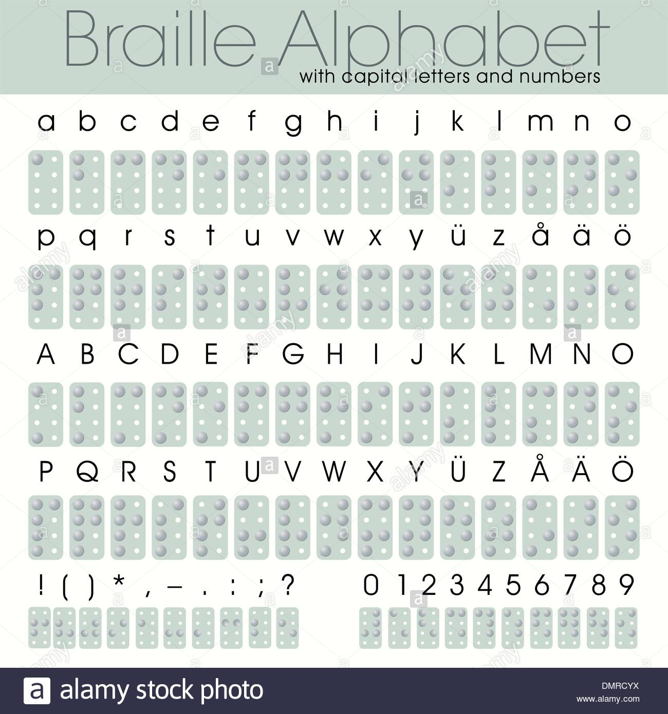

# Braille-Library
## Project AnyView
Arduino Library for Refreshable Braille Cells and Braille display 
Simple video for the library installation and understandinf the functions: 
[Installation Video](https://drive.google.com/drive/folders/19WAqIL-NhV4G5J1RsrMgq6cPOxpzeN6h?usp=sharing)

*8-Dot braille* format is shown in the following image 

As per the above image, we have assigned each of the characters to the required movement of the pins. The ASCII Values can be found in the image

I hope you guys can innovate much further and create something amazing. 

